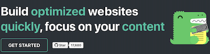

# 资产

import BrowserWindow from '@site/src/components/BrowserWindow';
import Tabs from '@theme/Tabs';
import TabItem from '@theme/TabItem';

有时，你想直接从 Markdown 文件链接到资产（例如 docx 文件、图片等），并且将资产与使用它的 Markdown 文件放在一起是很方便的。

假设我们有以下文件结构：

```
# 你的文档
/website/docs/myFeature.mdx

# 一些你想使用的资产
/website/docs/assets/docusaurus-asset-example-banner.png
/website/docs/assets/docusaurus-asset-example.docx
```

## 图片 {#images}

你可以通过三种不同的方式显示图片：Markdown 语法、CJS require 或 ES 导入语法。

```mdx-code-block
<Tabs>
<TabItem value="Markdown 语法">
```

使用简单的 Markdown 语法显示图片：

```md

```

```mdx-code-block
</TabItem>
<TabItem value="CommonJS require">
```

使用内联 CommonJS `require` 在 JSX 图片标签中显示图片：

```jsx

```

```mdx-code-block
</TabItem>
<TabItem value="导入语句">
```

使用 ES `import` 语法和 JSX 图片标签显示图片：

```jsx
import myImageUrl from './assets/docusaurus-asset-example-banner.png';

;
```

```mdx-code-block
</TabItem>
</Tabs>
```

上述所有方法都会显示图片：

<BrowserWindow>



</BrowserWindow>

:::note

如果你使用 [@docusaurus/plugin-ideal-image](../../api/plugins/plugin-ideal-image.mdx)，你需要使用专用的图片组件，具体请参考文档。

:::

## 文件 {#files}

同样，你可以通过 `require` 现有资产，并在 `video`、`a` 锚链接等中使用返回的 URL。

```md
# 我的 Markdown 页面

<a target="\_blank" href={require('./assets/docusaurus-asset-example.docx').default}> 下载此 docx </a>

或

[使用 Markdown 下载此 docx](./assets/docusaurus-asset-example.docx)
```

<BrowserWindow>

<a
  target="_blank"
  href={require('../../assets/docusaurus-asset-example.docx').default}>
  {'下载此 docx'}
</a>

[使用 Markdown 下载此 docx](../../assets/docusaurus-asset-example.docx)

</BrowserWindow>

:::info Markdown 链接始终是文件路径

如果你使用 Markdown 图片或链接语法，所有资产路径将被 Docusaurus 解析为文件路径，并自动转换为 `require()` 调用。除非你使用 JSX 语法，否则不需要在 Markdown 中使用 `require()`。

:::

## 行内 SVG {#inline-svgs}

Docusaurus 支持行内使用 SVG。

```jsx
import DocusaurusSvg from './docusaurus.svg';

<DocusaurusSvg />;
```

<BrowserWindow>

import DocusaurusSvg from '@site/static/img/docusaurus.svg';

<DocusaurusSvg />

</BrowserWindow>

这在你想通过 CSS 更改 SVG 图片的某个部分时非常有用。例如，你可以根据当前主题改变 SVG 的某种颜色。

```jsx
import DocusaurusSvg from './docusaurus.svg';

<DocusaurusSvg className="themedDocusaurus" />;
```

```css
[data-theme='light'] .themedDocusaurus [fill='#FFFF50'] {
  fill: greenyellow;
}

[data-theme='dark'] .themedDocusaurus [fill='#FFFF50'] {
  fill: seagreen;
}
```

<BrowserWindow>
  <DocusaurusSvg className="themedDocusaurus" />
</BrowserWindow>

## 主题图片 {#themed-images}

Docusaurus 支持主题图片：`ThemedImage` 组件（包含在主题中）允许你根据当前主题切换图片源。

```jsx
import useBaseUrl from '@docusaurus/useBaseUrl';
import ThemedImage from '@theme/ThemedImage';

<ThemedImage
  alt="Docusaurus 主题图片"
  // highlight-start
  sources={{
    light: useBaseUrl('/img/docusaurus_light.svg'),
    dark: useBaseUrl('/img/docusaurus_dark.svg'),
  }}
  // highlight-end
/>;
```

```mdx-code-block
import useBaseUrl from '@docusaurus/useBaseUrl';
import ThemedImage from '@theme/ThemedImage';

<BrowserWindow>
<ThemedImage
  alt="Docusaurus 主题图片"
  sources={{
    light: useBaseUrl('/img/docusaurus_keytar.svg'),
    dark: useBaseUrl('/img/docusaurus_speed.svg'),
  }}
/>
</BrowserWindow>
```

### GitHub 风格的主题图片 {#github-style-themed-images}

GitHub 使用自己的 [图片主题方法](https://github.blog/changelog/2021-11-24-specify-theme-context-for-images-in-markdown/) 通过路径片段，你可以轻松实现。

要使用路径片段切换图片的可见性（对于 GitHub，使用 `#gh-dark-mode-only` 和 `#gh-light-mode-only`），请将以下内容添加到你的自定义 CSS 中（如果你不想与 GitHub 关联，可以使用自己的后缀）：

```css title="src/css/custom.css"
[data-theme='light'] img[src$='#gh-dark-mode-only'],
[data-theme='dark'] img[src$='#gh-light-mode-only'] {
  display: none;
}
```

```md

```

<BrowserWindow>


</BrowserWindow>

## 静态资产 {#static-assets}

如果 Markdown 链接或图片具有绝对路径，则该路径将被视为文件路径，并从静态目录中解析。例如，如果你将 [静态目录](../../static-assets.mdx) 配置为 `['public', 'static']`，则对于以下图片：

```md title="my-doc.md"

```

Docusaurus 会尝试在 `static/img/docusaurus.png` 和 `public/img/docusaurus.png` 中查找该图片。该链接将被转换为 `require()` 调用，而不是保留为 URL。这在两个方面是可取的：

1. 你不必担心基本 URL，Docusaurus 会在提供资产时处理；
2. 图片进入 Webpack 的构建管道，其名称将附加一个哈希，这使得浏览器能够积极缓存图片，提高你的网站性能。

如果你打算编写 URLs，可以使用 `pathname://` 协议来禁用自动资产链接。

```md

```

该链接将生成 ``，不会经过任何处理或文件存在检查。